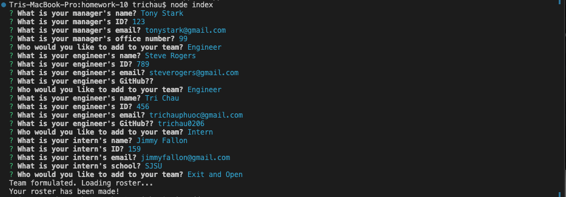
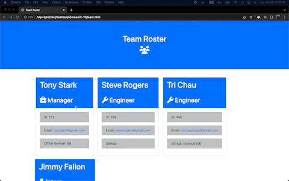

# 10 Object-Oriented Programming: Team Profile Generator

## Task

Build a Node.js command-line application that takes in information about employees on a software engineering team, then generates an HTML webpage that displays summaries for each person. 

This will require the use of the `Inquirer` package, ensure that you install and use Inquirer version 8.2.4. To do so, use the following command in your project folder: `npm i inquirer@8.2.4`.

## Test key

```
npm test
```


## Result


## Walkthrough Video
(https://drive.google.com/file/d/1InoOM-1EZvU8ucutTsq6ImfByI_F4H-i/view?usp=share_link)